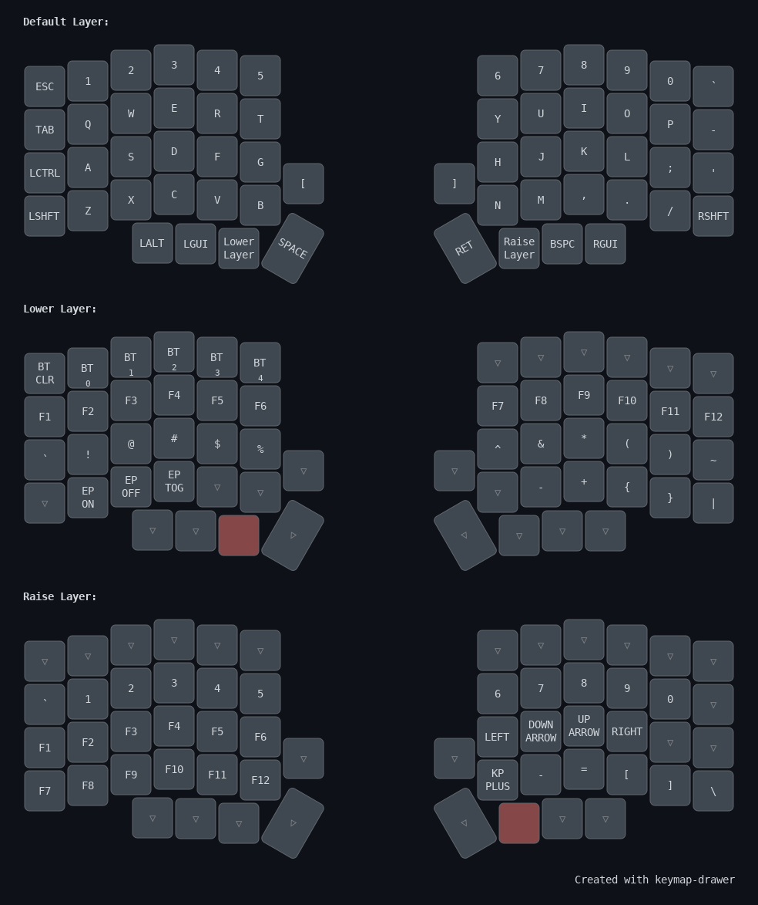

# Lily58 ZMK Configuration

This repository contains the ZMK firmware configuration for a Lily58 split keyboard with Nice Nano v2 controllers.

## Hardware

- **Keyboard**: Lily58 (58-key split keyboard)
- **Controller**: Nice Nano v2 (nRF52840-based)
- **Features**: OLED display enabled, Bluetooth wireless

## Layout



## Features

- Split keyboard with separate firmware for left and right halves
- Bluetooth connectivity for wireless operation
- OLED display showing keyboard status
- Multiple layers:
  - Default layer with QWERTY layout
  - Lower layer with function keys and Bluetooth controls
  - Raise layer with numbers and vim-style navigation

## Building Firmware

### GitHub Actions (Recommended)

Firmware builds automatically on every push using GitHub Actions. Download the compiled `.uf2` files from the Actions artifacts.

### Local Build

To build locally using west:

```bash
# Build left half
west build -d build/left -b nice_nano_v2 -- -DSHIELD=lily58_left

# Build right half  
west build -d build/right -b nice_nano_v2 -- -DSHIELD=lily58_right

# Clean build
west build -p
```

## Installation

1. Download the firmware files from GitHub Actions artifacts
2. Put your Nice Nano controller into bootloader mode
3. Copy the appropriate `.uf2` file to the controller
4. Repeat for both left and right halves

## Configuration Files

- `config/lily58.keymap` - Main keymap configuration
- `config/lily58.conf` - Hardware feature configuration
- `build.yaml` - GitHub Actions build matrix
- `keymap.yaml` - High-level keymap visualization

## Customization

To modify the keymap, edit `config/lily58.keymap` and push to trigger a new build. The keymap uses ZMK's device tree syntax.
